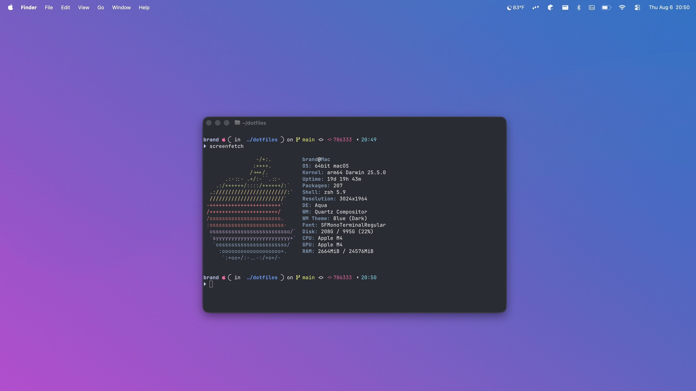
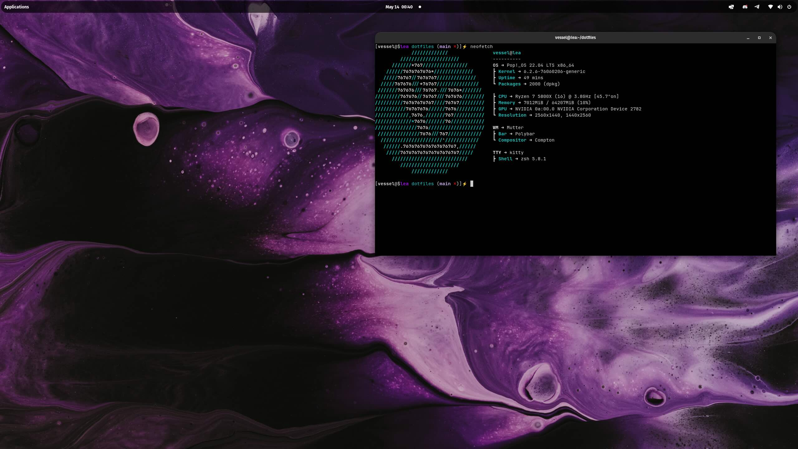

<div align="center">

</div>

<div align="center">
  <p></p>
  <p><b><i> ~ Personal Dotfiles ~ </i></b></p>
  
  
  
  
  
</div>


|  |  |
| --- | --- |

## ***Tools***

- **Terminal**: Ghostty / Terminator
- **Editor**: NeoVim
- **Browser**: Brave
- **Shell**: Zsh
- **App Laucher**: Spotlight / Rofi
- **Font**: JetBrainsMonoNFM

## ***Installation from CLI Script***
These steps are recommended for work computers, containers, and other potentially ephemeral systems.
1. Run this command below
`curl -s https://raw.githubusercontent.com/shroudedhorizon/dotfiles/refs/heads/main/configure_system.sh | sh`

Follow the system prompts on screen.

## ***Installation with Git***
These steps are recommended if you want to make changes to these dotfiles yourself and commit them. For personal computers.
1. Clone this directory to your home directory.
2. Run the makefile command to symbolically link all of the configurations to this repository and install dependencies.
### Usage

```bash
cd ~

cd dotfiles/

make all
```

## ***Windows Installation***
See this [README.md](../windows/README.md).
